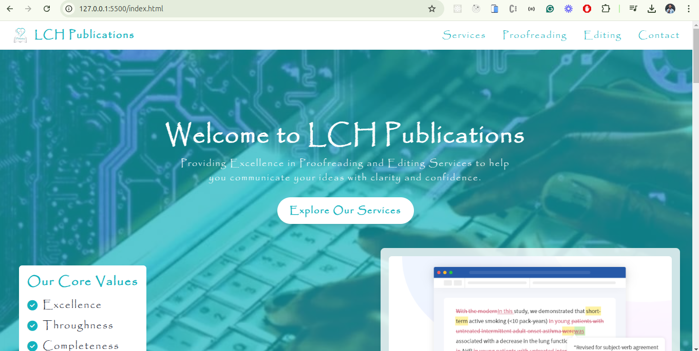
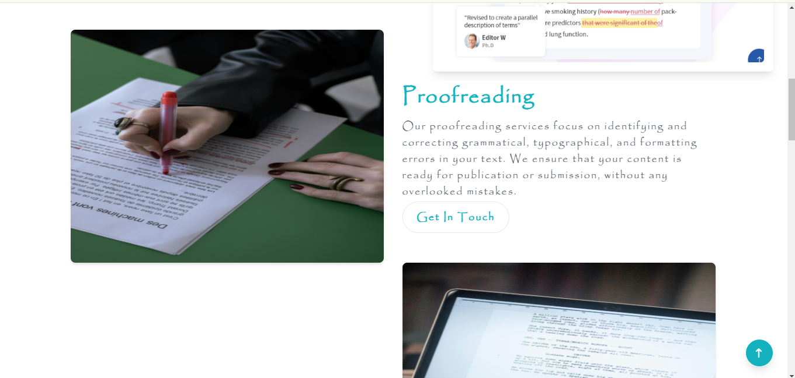
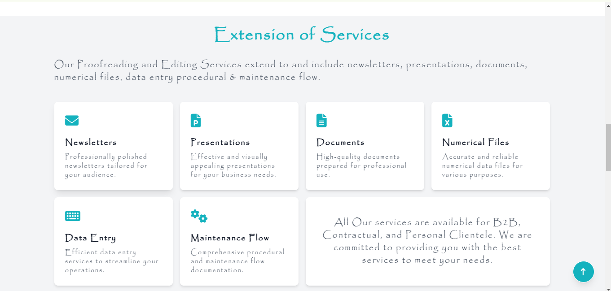
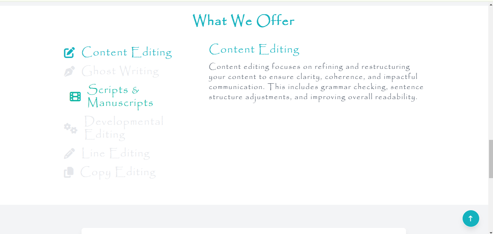
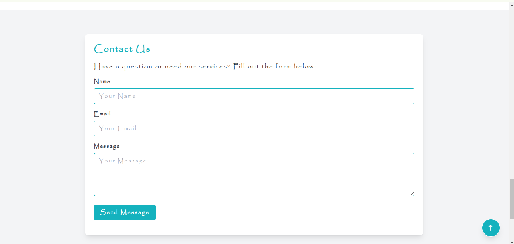

# LCH Publications

LCH Publications is a website that offers professional proofreading and editing services. The website provides detailed information about the services offered and allows users to contact the company through a contact form.

## Table of Contents

- [Features](#features)
- [Screenshots](#screenshots)

## Features

- **Responsive Design**: The website is fully responsive and works on all devices.
- **Service Descriptions**: Detailed descriptions of various proofreading and editing services.
- **Contact Form**: Users can contact the company through a contact form.
- **Smooth Scrolling**: Smooth scrolling for a better user experience.
- **Animations**: Animations using AOS (Animate On Scroll) library.

## Screenshots

